|  |  |  |    
| :-: | :-: | :-: |     

# Hydroponic-Control-System

This is a PoC for a hydroponic control system built with RAKwireless WisBlock modules.

The idea is to use the WisBlock system to measure

- nutrition level of the water with a TDS or EC sensor
- pH value of the water with a pH sensor (due to conflict between TDS and pH sensor not implemented)
- water level of the water tank (not implemented yet)

and to control

- water pump on and off times
- add nutrition if it is too low

As a backend control and visualization Grafana and NodeRED are used which are installed on a WisGate Connect RAK7391 together with a Chirpstack V4 LoRaWaN server and the gateway concentrator RAK2287 which connects the WisBlock Sensor and Control units with Chirpstack V4.

And as a "nice-to-have" I build a simple display with an e-ink screen. It receives its data from the sensor node through NodeRED.

Some images of the PoC setup:
| Hydroponic System | WisBlock Sensor |
| :---------------: | :-------------: |
|  | 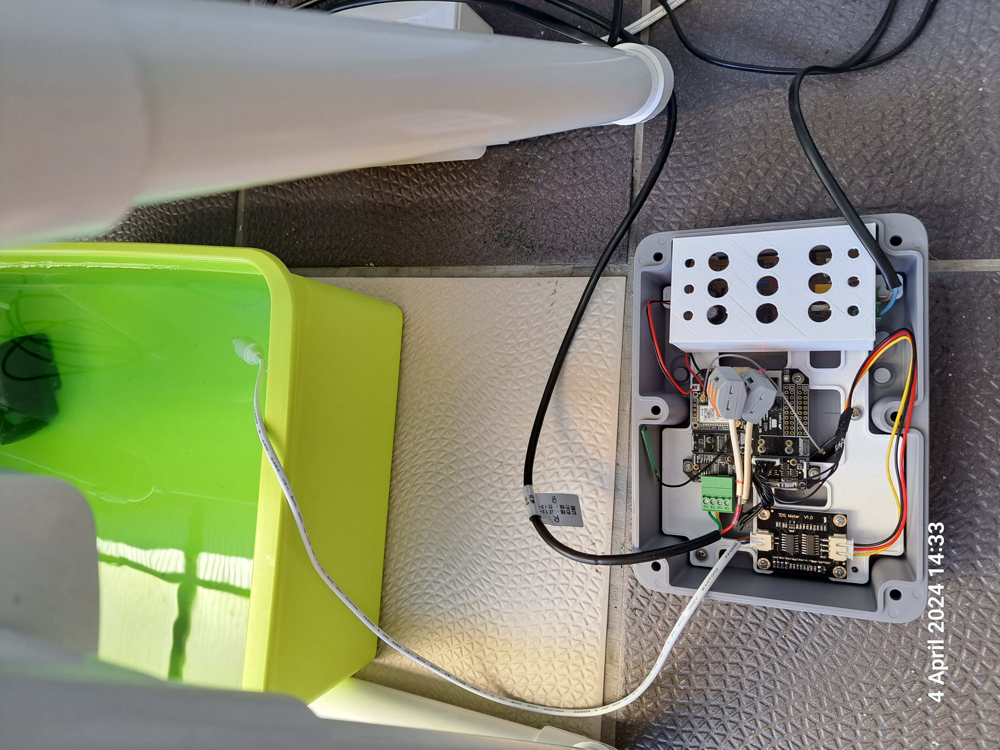 | 
|  WisBlock Control | Pump and Valve |
|  |  |
| WisGate Connect | Display 
| 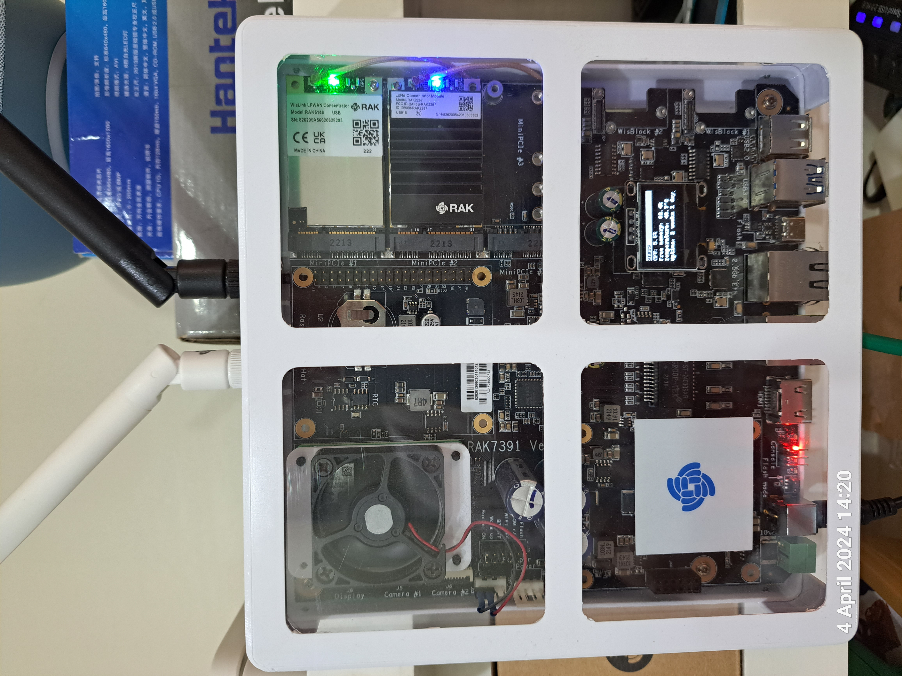 | 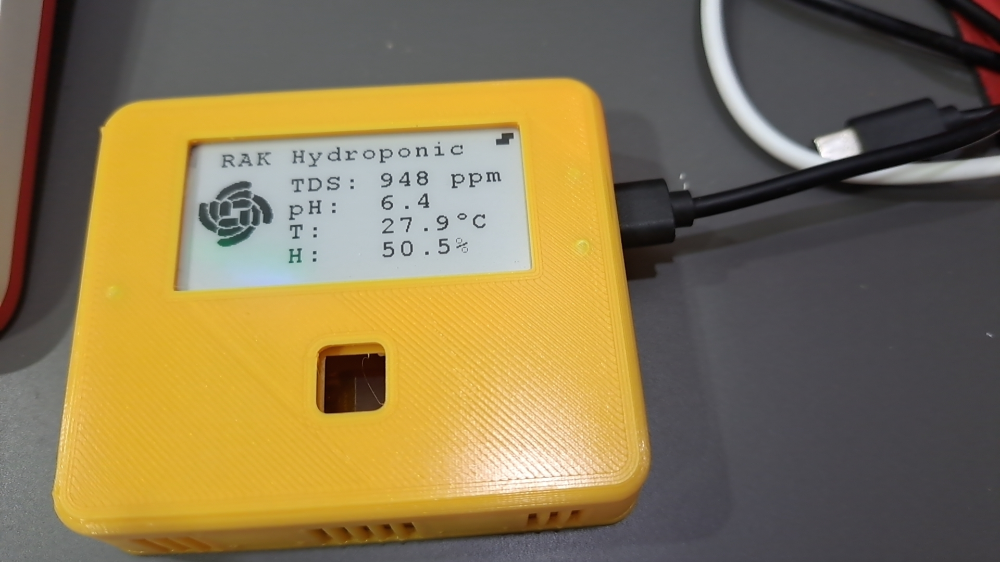 | 
| CS V4 & Grafana | NodeRED control |
|  </br> 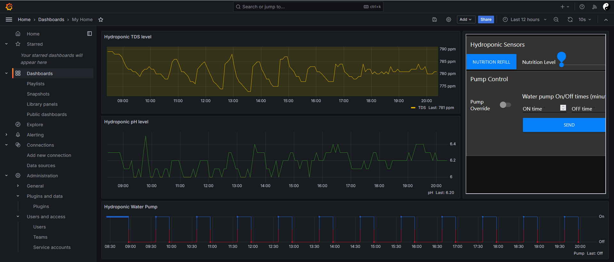 | 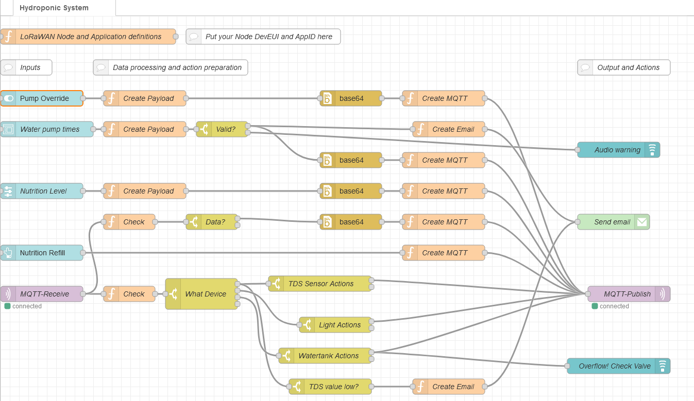 |

----
----

## Working principle

### WisBlock Sensor Node
The WisBlock Sensor Node uses a water TDS sensor to measure the concentration of nutrition in the water tank. It uses as well a second sensor to measure the pH value inside the water tank. This detects if the water tank contains enough nutrition for the plants. These values are measured every 5 minutes and send over LoRaWAN to the server. Depending on a treshold for the nutrition level, the Sensor Node adds a command to start refilling the water tank with highly concentrated nutrion to the data packet.    
_The measure interval and the nutrition threshold can be setup through AT commands _**AND**_ through a received downlink from the server application (NodeRED)._    
As a future extension a light sensor and a water level sensor are planned to be connected to the WisBlock Sensor Node.    
The used hardware of the WisBlock Sensor Node can be found in the table [Sensor Node](#sensor-node)

----

### WisBlock Control Node
The WisBlock Control Node uses 2 relay modules to control the water pump in the tank and the valve on the separate nutrition tank.    
_The water pump and the nutrition supply valve can be remotely controlled through a received downlink from the server application (NodeRED)._    
The used hardware of the WisBlock Sensor Node can be found in the table [Control Node](#control-node)

----

### LoRaWAN Gateway and LoRaWAN server
As a base for the gateway and the LoRaWAN server the [RAK7391 WisGate Connect](https://store.rakwireless.com/products/wisgate-connect-smart-building-edge-gateway-for-smart-building-smart-soho-solutions) is used. The WisGate Connect is based on a Raspberry CM4 module with expansion slots for concentrator modules (the "gateways").    
With the [RAKPiOS](https://docs.rakwireless.com/Product-Categories/Software-APIs-and-Libraries/RAKPiOS/Overview/) running on the WisGate Connect, the LoRaWAN server application, concentrator handlers and NodeRED as control application can be installed by using Docker. In addition an influxDB database and Grafana for the data visualization is running on the WisGate Connect as Docker containers as well.    

The concentrators are the gateways between the WisBlock Nodes and the LoRaWAN server.    
As LoRaWAN server the Chirpstack V4 is used. On the LoRaWAN server the application and devices are setup for the system.     
The Mosquitto MQTT Broker of Chirpstack V4 is the interface between the LoRaWAN server and NodeRED.     
The influxDB integration of Chirpstack V4 is used to send the received data to the influxDB database from where they are read by Grafana for visualization.    

----

### NodeRED
NodeRED receives all incoming packets from the sensor and relay node through the MQTT broker. It then analyzes the received data and decides whether actions are required. At this time only actions based on data from the TDS sensor are implemented. If the TDS sensor reports too low nutrition levels, a downlink to the WisBlock Control Node is initiated to open the nutrition valve and add additional nutrition to the water tank. In addition NodeRED sends an email to inform about the low level.        
In future extensions, the control of a "plant grow light" and automatic refill of the water tank are planned.    
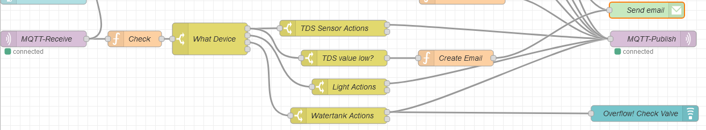     

Additional functions for manual control are implemented in NodeRED:    
(1) Manual control of the water pump. With a switch element in the user interface, the timer function for the water pump in the WisBlock Control Node can be disabled and the water pump is switched to permanent activity, until the switch is set to off again.    
(2) The water pump on/off times can be set in the user interface. These values are sent as a downlink to the WisBlock Control Node and saved in the flash memory and used until they are changed.    
(3) The nutrition level treshold can be set as well in the user interface. This value is sent as a downlink to the WisBlock Sensor Node and saved in the flash memory. This allows to adjust the required nutrition levels to the growth status of the plants.    
(4) The nutrition level can be raised as well with the user interface. This can be used after a refresh of the water in the tank to get up the nutrition levels faster to the desired values.    
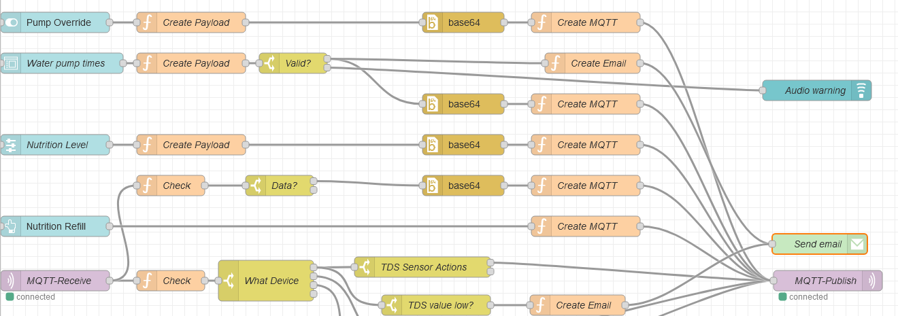    

----

### Grafana
Grafana is used to visualize the status of the nutrition levels, the pH value in the water tank and to show the on/off times of the water pump.   

Additionaly the user interface of NodeRED is added as an iFrame, so that the control functions can be used directly from the visualization platform.    

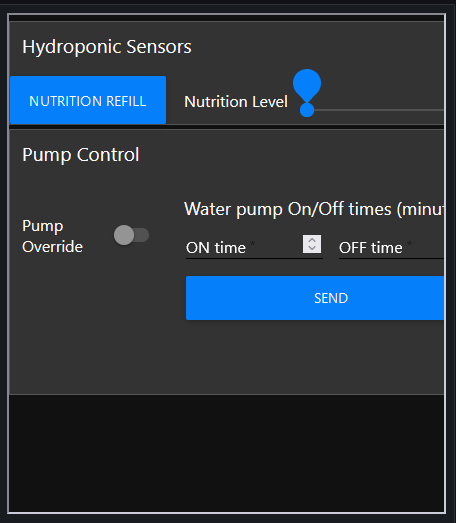

----

### WisBlock Display
The WisBlock Display was added as a "nice-to-have" device to get an overview of the hydroponic systems status.     
It receives the data as downlinks from NodeRED as well and shows TDS, pH, temperature and humitity levels on an e-ink display.    
The display is assembled in a 3D printed enclosure. 
The used hardware of the WisBlock Sensor Node can be found in the table [Display Node](#display-node)


----
----

## Data Flow
<center> 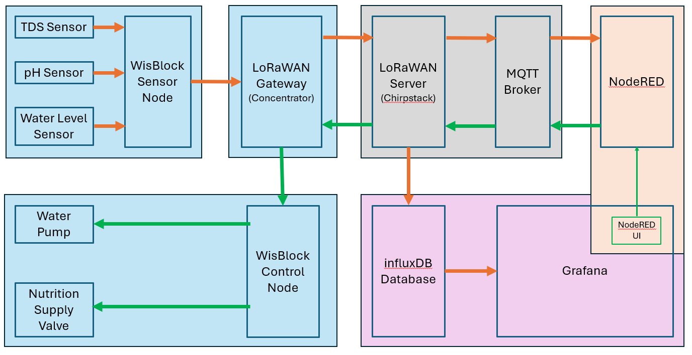 </center>

----
----

## WisBlock Node Software used

### WisBlock Sensor Node
The firmware for the Sensor Node is based on Arduino BSP and is using the WisBlock-API-V2 for low power and LoRa/LoRaWAN support. Source code is in the [Hydroponic-Sensor folder](./Hydroponic-Sensor).    

The WisBlock Sensor Node has two downlink commands to change settings from NodeRED without connecting to the device physically. One command is to set the nutrition level treshold (when to add additional nutrition), the other one is to set the calibrate value the TDS sensor (required for dfRobot sensor).    
The structure of the downlinks is fixed as:

| Header | Command | Value |
| --- | --- | --- |
| 0xAA 0x55 | 0x01 | 4 bytes nutrition treshold value, MSB first |
| 0xAA 0x55 | 0x02 | 2 bytes calibration factor, multiplied by 100, MSB first |

Examples:    
Payload `{0xAA, 0x55, 0x01, 0x00, 0x00, 0x03, 0x20}` will set the nutrition level treshold to 800 (0x0320).    
Payload `{0xAA, 0x55, 0x02, 0x00, 0x38}` will set the calibration factor to 0.56 (0.56 * 100 == 0x0038).

⚠️ The downlink _**MUST**_ be send on fPort 11! ⚠️

----

### WisBlock Control Node
The firmware for the Control Node is based on RUI3 BSP. Source code is in the [Hydroponic-Relays folder](./Hydroponic-Relays).    

The WisBlock Control Node has three downlink commands to remotely control the water pump, the nutrition valve and the pump on/off times.    
They are devided into two groups:    
a) control commands
b) setup commands

The structure of the control commands is fixed as:

| Header | Control Select | Value | Action | 
| --- | --- | --- | --- |
| 0xAA 0x55 | 0x00 | 0x00 | Water pump off |
| 0xAA 0x55 | 0x00 | 0x01 | Water pump on |
| 0xAA 0x55 | 0x01 | 0x00 | Nutrition valve close |
| 0xAA 0x55 | 0x01 | 0x01 | Nutrition valve open for 10 seconds |
| 0xAA 0x55 | 0x01 | 0x03 | Nutrition valve open for 30 seconds |

Examples:    
Payload `{0xAA, 0x55, 0x00, 0x01`} will switch the pump on and disable the timer that is usually controlling the on/off times.    
Payload `{0xAA, 0x55, 0x01, 0x03}` will open the nutrition valve for 30 seconds.

⚠️ The downlink _**MUST**_ be send on fPort 10! ⚠️

The structure for the setup commands is fixed as:

| Header | Command | Value |
| --- | --- | --- |
| 0xAA 0x55 | 0x01 | 4 bytes on time in seconds, 4 bytes off time in seconds, MSB first |

Examples:    
Payload `{0xAA, 0x55, 0x01, 0x00, 0x00, 0x02, 0x58, 0x00, 0x00, 0x0B, 0xB8}` sets the on time to 600 seconds (10 minutes) and the off time to 3000 seconds (50 minutes).

⚠️ The downlink _**MUST**_ be send on fPort 11! ⚠️

----

### WisBlock Display Node
The firmware for the Display Node is based on RUI3 BSP. Source code is in the [Hydroponic-Display folder](./Hydroponic-Display).    

----
----

## Software on the WisGate Connect RAK7391

### RAKPiOS
RAKPiOS, a custom OS based on the Raspberry Pi OS that includes all of the required drivers, some security changes, helper scripts, and Docker by default. The RAKPiOS is designed for the RAKwireless WisGate Connect.

[RAKPiOS Documentation](https://docs.rakwireless.com/Product-Categories/Software-APIs-and-Libraries/RAKPiOS/Overview/)

<center> 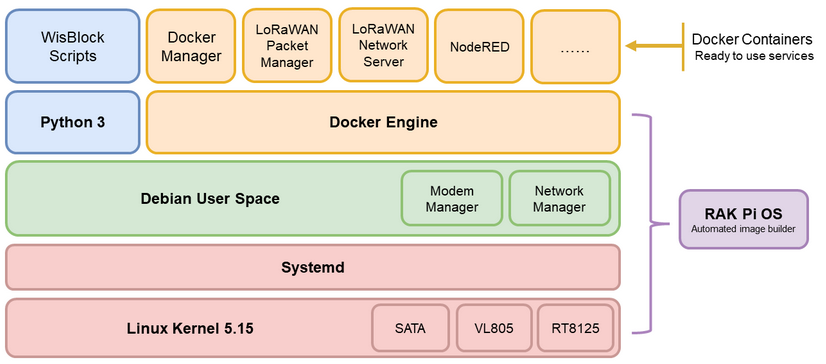 </center>

### Docker containers
All applications used on the WisGate Connect are installed using Docker. This makes the setup and the maintainence much simpler.    
For the installation of the application a docker-compose.yml file was used. The yaml file can be found in [docker-compose.yml](./Docker/docker-compose.yml).    

⚠️This yaml file works for my installation, but you should carefully adjust it to your requirments. Special the udp-packet-forwarder needs to be updated with new gateway EUI's and their location info.⚠️    

For manual installation, the following Docker containers are installed:    
- _**rakwireless/udp-packet-forwarder:latest**_ (two instances, one for AS923-3, one for EU868, only one is needed for final deployment)
- _**chirpstack/chirpstack:4**_
- _**chirpstack/chirpstack-gateway-bridge:4**_ (three instances, one for AS923-3, one for EU868 and one for Basic Station, which I didn't use)
- _**chirpstack/chirpstack-rest-api:4**_ (unused, just in case)
- _**postgres:14-alpine**_ (required by Chirpstack)
- _**redis:7-alpine**_ (required by Chirpstack)
- _**eclipse-mosquitto:2**_ (required by Chirpstack)
- _**grafana/grafana:latest**_
- _**influxdb:latest**_

For debugging and container management I installed as well [Portainer](https://github.com/portainer/portainer).     
<center> 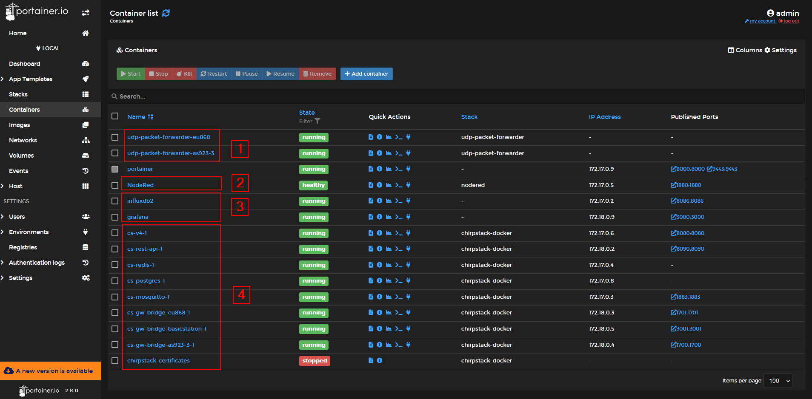 </center>

[1] Are the containers with the UDP packet forwarders for the concentrators.       
[2] Is the control application NodeRED       
[3] Ate the visualization and databank applications    
[4] Is the complete Chirpstack V4 installation

----

### Concentrators / UDP Packet Forwarders
The two instances of the UDP packet forwarders are setup for the used RAK5146 (EU868) and RAK2247 (AS923-3) RAK concentrator modules.     
⚠️ These setups have to be adjusted to the actual hardware configuration. ⚠️    

As two LoRaWAN regions are used, one region is setup for UDP port 1700 in Chirpstack and the other region is setup for UDP port 1701.    

----

### LoRaWAN server
For the LoRaWAN server a Docker container with Chirpstack V4 is used. The LNS is setup for two gateways, one supporting AS923-3 and the other one for EU868. It has a dedicated application for the hydroponic system where the WisBlock Nodes are registered.    
<center> 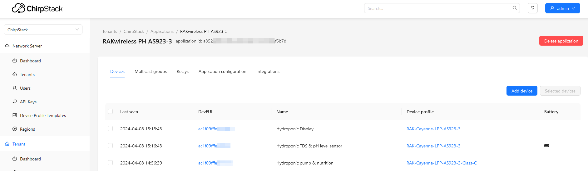 </center>

For the devices, two device profiles are used. One is for a Class C, which is used for the WisBlock Control Node, as it has to receive downlinks (commands) immediately. The other one is for Class A devices and is used for the WisBlock Sensor Node and the Display Node.    

Both device profiles are using the same uplink decoders, the uplinks are formatted in an extend Cayenne LPP format. The usage of an uplink decoder allows to have the decoded data in the MQTT messages. This makes it easier in NodeRED and Grafana to analyze and visualize the received data. The decoder can be found in [Chirpstack-Decoder.js](./Chirpstack/Chirpstack-Decoder.js).     

In addition, the application is setup with an _**influxDB v2**_ integration to forward the data into a database.    
<center> 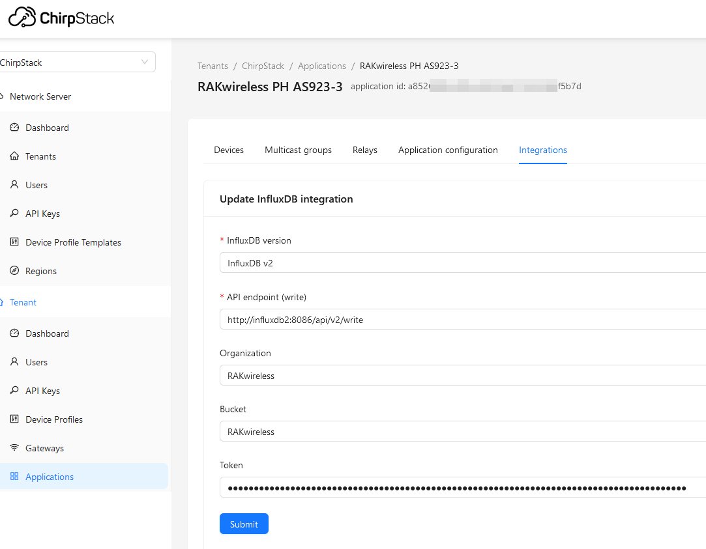 </center>    
Thanks to the usage of Docker, instead of a complete IP address or URL, the _**influxdb2_** in the API endpoint is pointing to the correct address of influxDB2.

----

### influxDB v2 and Grafana
The combination of InfluxDB v2 and Grafana is used for the visualization of some node data. Grafana is connected to InfluxDB v2 to collect the information the database receives from the Chirpstack integration.     
⚠️ This combination was used for an simple installation on the WisGate Connect. ⚠️    
It can be replaced with other visualizations, like Datacake.    

As the data is already decoded in the Chirpstack decoder, the query from Grafana to influxDB v2 is much simpler and it is not required to actually decode the received payloads:    
```flux
from(bucket: "RAKwireless")
  |> range(start: v.timeRangeStart, stop: v.timeRangeStop)
  |> filter(fn: (r) => r["_measurement"] == "device_frmpayload_data_concentration_64")
  |> filter(fn: (r) => r["_field"] == "value")
  |> filter(fn: (r) => r["dev_eui"] == "ac1f09fffe000000")
  |> aggregateWindow(every: v.windowPeriod, fn: last, createEmpty: false)
  |> yield(name: "last")
```

For the integration of the NodeRED UI into Grafana a _**`Text`**_ visualization was used and the NodeRED UI is embedded as an iframe:    
<center> 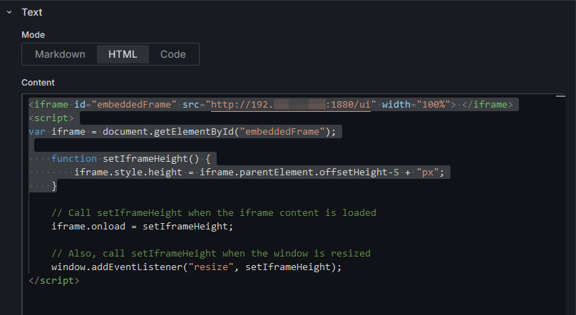 </center>

----

### NodeRED
This is the most complex part of the PoC.    
The Hydroponic System Flow is not only receiving data from through MQTT from the end nodes, it has as well to send downlinks to the nodes with information and control commands.    
In addition, through the NodeRED UI, manual control functions are implemented that allow to control or override different aspects of the system.     

⚠️ The complete NodeRed flow can be downloaded from [flows.json](./NodeRED/flows.json) ⚠️     

#### Preparation

The NodeRED workflow is using some contributions that are not in the default installed palette:    

_**`node-red-dashboard`**_ for the UI    
_**`node-red-node-base64`**_ required to create Base64 encoded payload    
_**`node-red-node-email`**_ required to send out emails with warnings 

#### NodeRED global settings
To keep the nodes flexible and to avoid editing nodes if a device or application credential has changed, four global variables are set during the start of the flow. Using this method, the values have to be changed only in one node, even if they are used in many other nodes.    

<center> 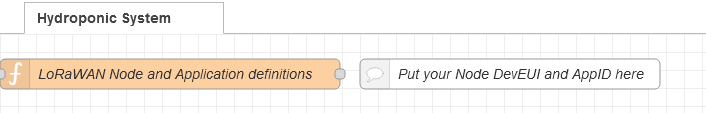 </center>

```js
// Code added here will be run once
// whenever the node is started.
global.set("relay_dev_eui", "ac1f09fffe000000");
global.set("sensor_dev_eui", "ac1f09fffe0c0000");
global.set("display_dev_eui", "ac1f09fffe000000");
global.set("app_id", "a852689f-0000-0000-0000-b073a96f5b7d");

node.warn("relay_dev_eui = " + global.get("relay_dev_eui"));
node.warn("sensor_dev_eui = " + global.get("sensor_dev_eui"));
node.warn("display_dev_eui = " + global.get("display_dev_eui"));
node.warn("app_id = " + global.get("app_id"));
```

# ⚠️⚠️⚠️
# DO NOT USE THE SAME EUI's AND ID's
# You have to setup these variable to the actual devices used in your system!
# ⚠️⚠️⚠️

----

#### NodeRED MQTT subscribe
To receive the node data, NodeRED is subscribing to the Chirpstacks MQTT broker (Mosquitto):    
<center> 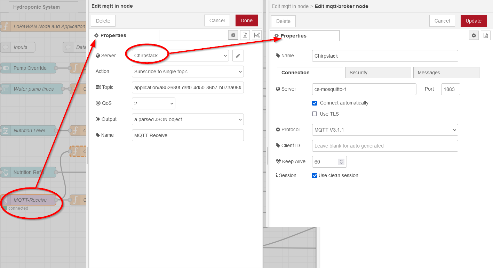 </center>
In this PoC I used an unsecure connection. But in a real application, security should be added.    

----

#### NodeRED analyze incoming packets
In the next node, the data received from the MQTT broker is analyzed.    
(1) Check from which node the data comes    
(2) Check received values from the node    
(3) Check if actions are required based on the received data    
<center> 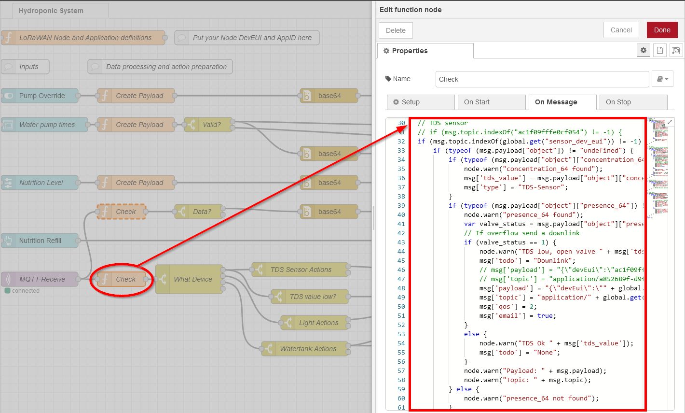 </center>    
Here is the code that picks out the data coming from the WisBlock Sensor Node (sensor_dev_eui). It checks if certain data is available (TDS sensor data = concentration_64, request to open the nutrition valve = presence_64).    

```js
// TDS sensor
if (msg.topic.indexOf(global.get("sensor_dev_eui")) != -1) { 
    if (typeof (msg.payload["object"]) != "undefined") {
        if (typeof (msg.payload["object"]["concentration_64"]) != "undefined") { // concentration_64 == TDS value
            node.warn("concentration_64 found");
            msg['tds_value'] = msg.payload["object"]["concentration_64"];// concentration_64
            msg['type'] = "TDS-Sensor";
        }
        if (typeof (msg.payload["object"]["presence_64"]) != "undefined") { // concentration_64 == TDS value
            node.warn("presence_64 found");
            var valve_status = msg.payload["object"]["presence_64"];
            // If overflow send a downlink
            if (valve_status == 1) {
                node.warn("TDS low, open valve " + msg['tds_value']);
                msg['todo'] = "Downlink";
                msg['payload'] = "{\"devEui\":\"" + global.get("relay_dev_eui") + "\", \"confirmed\":false,\"fPort\":10,\"data\":\"qlUBAQ==\"}" // pump on AA550101
                msg['topic'] = "application/" + global.get("app_id") + "/device/" + global.get("relay_dev_eui") + "/command/down";
                msg['qos'] = 2;
                msg['email'] = true;
            }
            else {
                node.warn("TDS Ok " + msg['tds_value']);
                msg['todo'] = "None";
            }
            node.warn("Payload: " + msg.payload);
            node.warn("Topic: " + msg.topic);
        } else {
            node.warn("presence_64 not found");
        }
    }
}
```
The TDS sensor value `"concentration_64"` is saved in `msg['tds_value']` and will later be used for the display node.    
If `"presence_64"` is `1`, the nutrition values are low and the valve for the nutrition refill needs to be opened.    
In this case the MQTT publish message is prepared here. This published message goes to the MQTT broker and Chirpstack will use it to send a downlink to the device to switch the nutrition valve on.    
For the MQTT publishing multiple fields are required and added to msg[]:    
| Field | Content |
| --- | --- |
| "payload" | - DevEUI of the receiving device, setup of confirmed/unconfirmed packet</br>- fPort to be used</br> - the LoRaWAN payload, encoded with Base64 |
| "topic" | The topic the data will be published to. It requires the Chirpstack Application ID, the DevEUI and the task to be performed by Chirpstack, here "/command/down" will start a downlink to the device |
| "qos" | With which QOS level the packet should be published |

Other fields are used in the next nodes:    
| Field | Content |
| --- | --- |
| "type" | is defining the node the data came from |
| "todo" | defines if further actions are required |
| "email" | defines whether an email with a warning should be sent |    

----

#### NodeRED switch _What Device_
In the switch the flow is split into different paths, depending on the device type:    
<center> 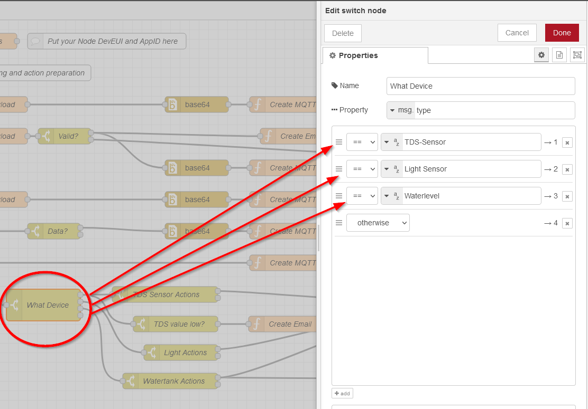 </center>     
In the PoC only the TDS sensor is connected, no light or water level sensors are implemented (yet).    

There are two possible actions for the TDS sensor, depending on the `"todo"` and "email" fields set in the previous node:    
| Field | Content | Action |
| --- | --- | --- |
| "todo" | "DownLink" | Send a downlink to switch on the nutrition valve |
|        | "None" | Nutrition levels are ok, no action needed |
| "email" | "true" | Nutrition levels are low, send a email as warning |
|         | NA | Nothing to send |

The "todo" and "email" fields are used in the next two switch functions, "TDS Sensor Actions" and "TDS value low?":    
<center> 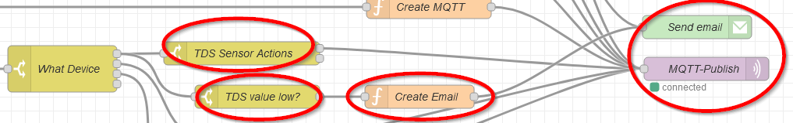 </center>  

----

#### NodeRED switch _TDS Sensor Action_
As the MQTT publish message is already defined, the "TDS Sensor Action" calls directly the "MQTT-Publish" node if "todo" is "Downlink".    
The "TDS value low" is calling "Create Email" if the field "email" is present.    

----

#### NodeRED switch _Create Email_
"Create Email" is preparing the fields required to send out a message per email:    
```js
msg.topic = 'Hydroponic nutrition level low';
msg.payload = 'Nutrition level: ' + msg['tds_value'] + ' ppm';
return msg;
```    
and then calls the "Send email" node, which is sending out the message:    
<center> 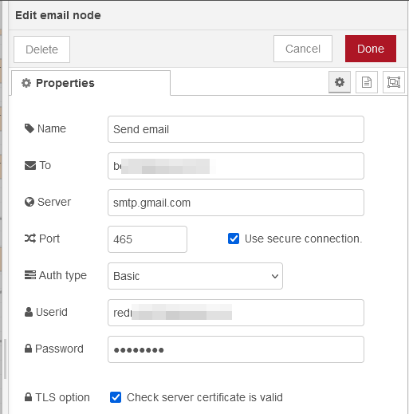 </center> 

The other nodes to handle light sensor and water tank level depending on received sensor values are not implemented yet.    

----

#### NodeRED Nutrition Level
As the required nutrition levels are changing during the growth of the plants, it is necessary to adjust the levels at which the nutrition would be refilled.    
This is achieved by adding a selection slider to the NodeRED flow. The slider is accessible through the NodeRED UI.    
<center> 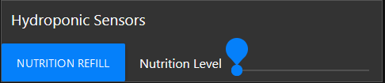 </center>     
In the PoC the nutrition levels can be set in 100ppm steps between 600 and 1600 ppm. This might need adjustment, specially for lower levels required during the early phase.    
The output of this node is used in "Create Payload" to get the values in the hex value array required for the downlink payload.     

```js
node.warn("Received: " + msg.payload);
switch (msg.payload)
{
    case 600:
        node.warn("level 600");
        msg.bvalue = Buffer.from([0xaa, 0x55, 0x01, 0x00, 0x00, 0x02, 0x58]);
        break;
    case 700:
        msg.bvalue = Buffer.from([0xaa, 0x55, 0x01, 0x00, 0x00, 0x02, 0xBC]);
        break;
    case 800:
        msg.bvalue = Buffer.from([0xaa, 0x55, 0x01, 0x00, 0x00, 0x03, 0x20]);
        break;
    case 900:
        msg.bvalue = Buffer.from([0xaa, 0x55, 0x01, 0x00, 0x00, 0x03, 0x84]);
        break;
    case 1000:
        msg.bvalue = Buffer.from([0xaa, 0x55, 0x01, 0x00, 0x00, 0x03, 0xe8]);
        break;
    case 1100:
        msg.bvalue = Buffer.from([0xaa, 0x55, 0x01, 0x00, 0x00, 0x04, 0x4c]);
        break;
    case 1200:
        msg.bvalue = Buffer.from([0xaa, 0x55, 0x01, 0x00, 0x00, 0x04, 0xb0]);
        break;
    case 1300:
        msg.bvalue = Buffer.from([0xaa, 0x55, 0x01, 0x00, 0x00, 0x05, 0x14]);
        break;
    case 1400:
        msg.bvalue = Buffer.from([0xaa, 0x55, 0x01, 0x00, 0x00, 0x05, 0x78]);
        break;
    case 1500:
        msg.bvalue = Buffer.from([0xaa, 0x55, 0x01, 0x00, 0x00, 0x05, 0xdc]);
        break;
    case 1600:
        msg.bvalue = Buffer.from([0xaa, 0x55, 0x01, 0x00, 0x00, 0x06, 0x40]);
        break;
}
return msg;
```     

(This code needs to be improved to directly create the byte array instead of using the switch() function)    

Then the "base64" node is converting the payload into Base64 and forwarded to the "MQTT-Publish" node.    

<center> 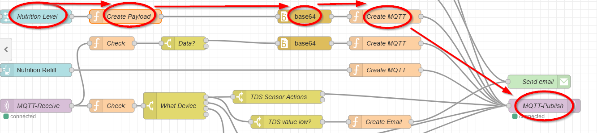 </center> 

----

#### Nutrition refill
During tests I found that specially during setup with plain water in the tank, the nutrition levels are only raising very slow. This is because the hose between the nutrition tank and the water tank is set to drip only for 10 seconds. Which adds too less nutrition during the setup.    
To accelerate the nutrition refill on a new setup, the UI button "Nutrition Refill" can be used to send a command to the WisBlock Control Node to keep the nutrition valve open for a longer time.    
The flow is very simple, from the UI button, the MQTT payload is created and then the command is sent to the device through the MQTT publish function.     

<center> 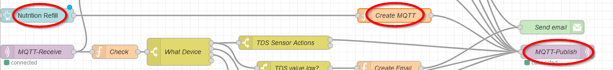 </center> 

```js
node.warn("TDS low, open valve " + msg['tds_value']);
msg['todo'] = "Downlink";
msg['payload'] = "{\"devEui\":\"" + global.get("relay_dev_eui") + "\", \"confirmed\":false,\"fPort\":10,\"data\":\"qlUDAQ==\"}" // pump long on AA550301
msg['topic'] = "application/" + global.get("app_id") + "/device/" + global.get("relay_dev_eui") + "/command/down";
msg['qos'] = 2;

node.warn("Payload: " + msg.payload);
node.warn("Topic: " + msg.topic);

return msg;
```

#### Water pump override
To override the timer settings on the WisBlock Control Node, the water pump can be manually switched on. This disables the timer control of the pump until the pump is manually switched off again.    
The water pump is controlled by a toggle switch in the UI:

<center> 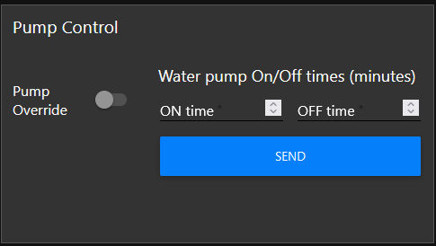 </center> 

<center> 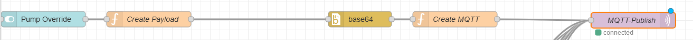 </center> 

```js
node.warn("Received: " + msg.payload);
switch (msg.payload)
{
    case true:
        node.warn("Pump On");
        msg.bvalue = Buffer.from([0xaa, 0x55, 0x00, 0x01]);
        break;
    case false:
        node.warn("Pump Off");
        msg.bvalue = Buffer.from([0xaa, 0x55, 0x00, 0x00]);
        break;
}
return msg;
```

#### Water pump on/off time settings
The timer based on/off control of the water pump can be set by the second control widget in the UI. The on and off times are set in minutes.    
As the WisBlock Control Node expects the timer values in seconds, they are converted from minutes to seconds before the downlink to the device is created.    
The timer settings are stored in the flash of the device and reused after a power-up or reset.    

<center> 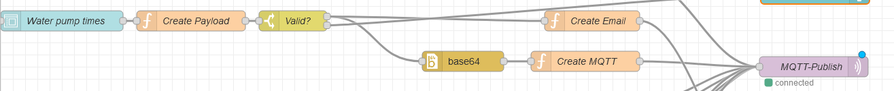 </center> 

```js
if (typeof (msg.payload.on_time) != "undefined") {
    if (typeof (msg.payload.off_time) != "undefined") {
        if ((msg.payload.on_time > msg.payload.off_time) || (msg.payload.off_time < 15) || (msg.payload.on_time < 5)) {
            node.warn("Wrong times");
            msg.todo = "None";
            msg.payload = "Wrong times";

        } else {
            msg.payload.on_time = msg.payload.on_time * 60;
            msg.payload.off_time = msg.payload.off_time * 60;
            msg.bvalue = Buffer.from([0xaa, 0x55, 0x00, (msg.payload.on_time & 0xff000000) >> 24,
                (msg.payload.on_time & 0x00ff0000) >> 16, (msg.payload.on_time & 0x0000ff00) >> 8,
                (msg.payload.on_time & 0x000000ff), (msg.payload.off_time & 0xff000000) >> 24,
                (msg.payload.off_time & 0x00ff0000) >> 16, (msg.payload.off_time & 0x0000ff00) >> 8,
                (msg.payload.off_time & 0x000000ff)]);
            msg.todo = "Downlink";
            node.warn("Valid times found");
        }
    } else {
        node.warn("No OFF time");
        msg.todo = "None";
        msg.payload = "No Off Time";
    }
} else {
    node.warn("No ON time");
    msg.todo = "None";
    msg.payload = "No On Time";
}

return msg;
```

----
----

## Hardware used

### Sensor Node

| [RAK19011 WisBlock Base Board with power slot](https://store.rakwireless.com/products/rak19011-dual-io-base-board-with-power-slot) | 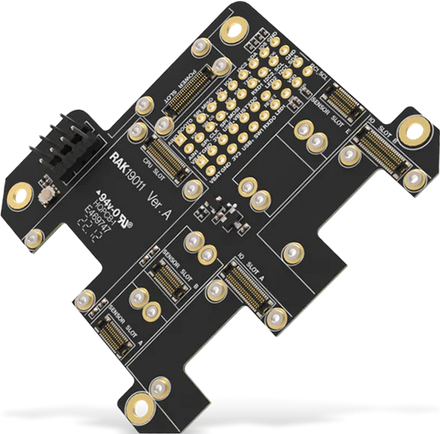 |
| --- | :-: |
| [RAK19016 5-24V Power Slot Module](https://store.rakwireless.com/products/rak19016-5-24v-power-slot-module) | 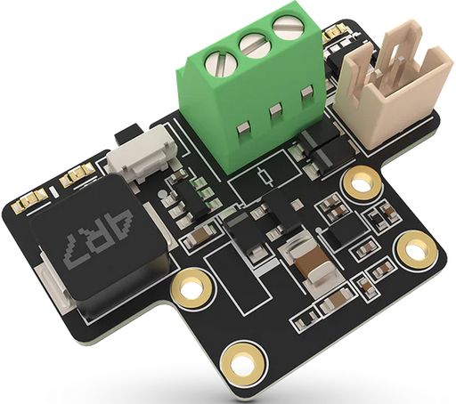 |
| [RAK4631 Android Core Module](https://store.rakwireless.com/products/rak4631-lpwan-node) | 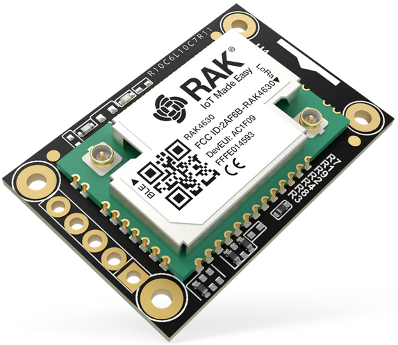 |
| [RAK5802 RS485 IO Module (for pH and TDS sensor)](https://store.rakwireless.com/products/rak5802-rs485-interface) | 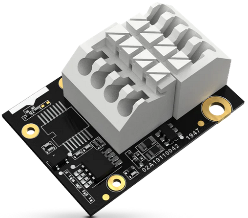 |
| [RAK5804 IO Module (temporary for dfRobot TDS sensor)](https://store.rakwireless.com/products/rak5804-wisblock-interface-extension-board) | 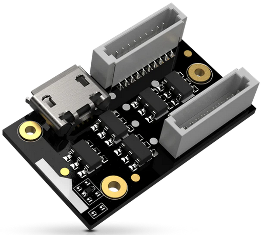 |
| [Unify Enclosure ](https://store.rakwireless.com/products/unify-enclosure-ip67-180-130-60mm) | 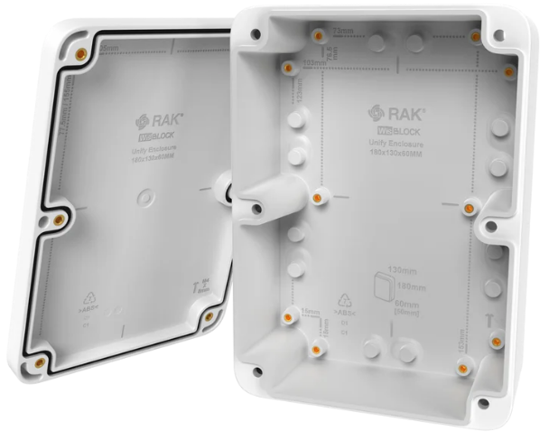 |
| dfRobot TDS sensor (temporary) | will be replaced by SensorHub TDS Water Sensor |
| 12V supply | third party 110/220V to 12V regulator |

----

### Control Node

| [RAK19001 WisBlock Base Board](https://store.rakwireless.com/products/rak19011-dual-io-base-board-with-power-slot) | 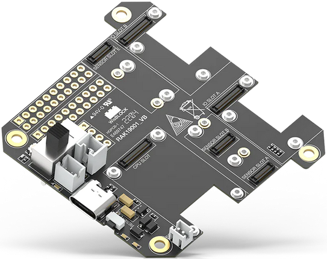 |
| --- | :-: |
| [RAK4631 RUI3 Core Module](https://store.rakwireless.com/products/rak4631-lpwan-node) |  |
| 2 x [RAK13007 220V Relay Module (water pump and nutrition valve)](https://store.rakwireless.com/products/rak13007-wisblock-relay) | 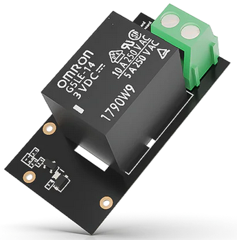 |
| [Unify Enclosure ](https://store.rakwireless.com/products/unify-enclosure-ip67-180-130-60mm) |  |
| 5V/12V supply | third party 110/220V to 5V and 12V regulator |

----

### Display Node

| [RAK19007 WisBlock Base Board](https://store.rakwireless.com/products/rak19007-wisblock-base-board-2nd-gen) | 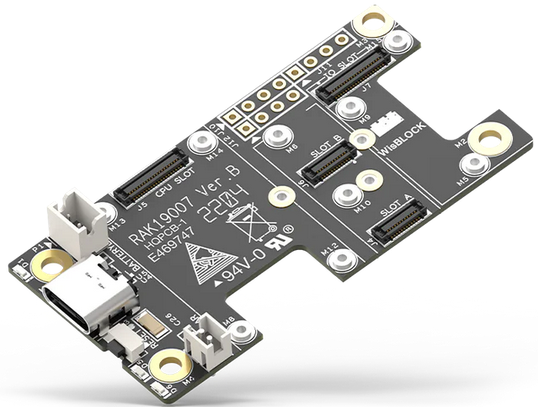 |
| --- | :-: |
| [RAK3372 RUI3 Core Module](https://store.rakwireless.com/products/wisblock-core-module-rak3372) | 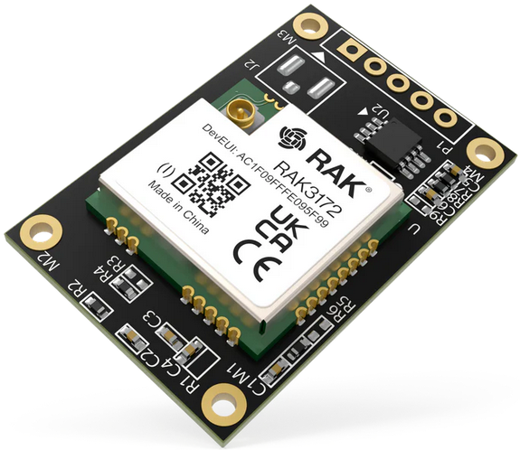 |
| [RAK14000 E-Paper Display Module](https://store.rakwireless.com/products/wisblock-epd-module-rak14000) | 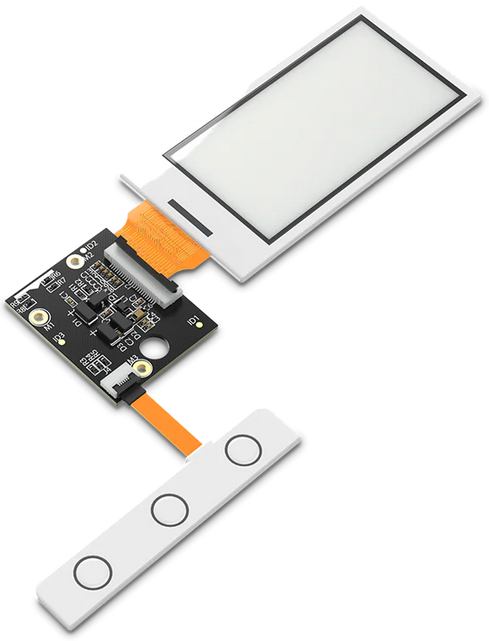 |
| 3D printed enclosure |  |
| 500mA Battery | power supply, lasts ~?? month without recharging with screen update every 5 minutes |

----

### WisGate Connect

| [RAK7391 WisGate Connect](https://store.rakwireless.com/products/wisgate-connect-smart-building-edge-gateway-for-smart-building-smart-soho-solutions) | 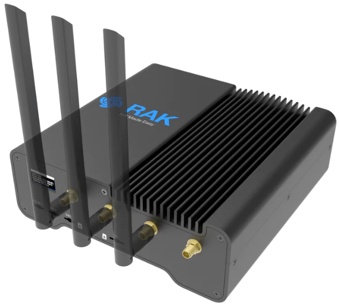 |
| --- | :-: |
| [RAK5146 USB EU868](https://store.rakwireless.com/products/wislink-concentrator-module-sx1303-rak5146-lorawan?variant=39677269213382) | 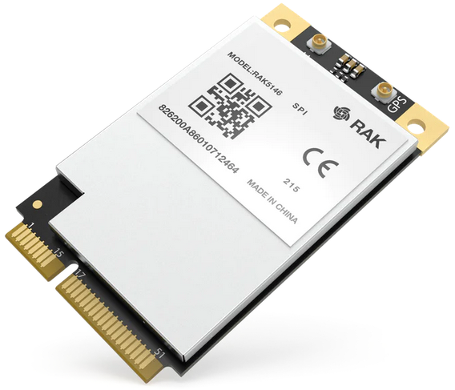 |
| [RAK2287 SPI AS923-3](https://store.rakwireless.com/products/wislink-concentrator-module-sx1302-rak2287-lorawan?variant=41826859319494) | 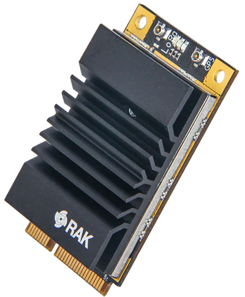 |

# ⚠️ IMPORTANT ⚠️
This PoC is using two concentrators (RAK5146 and RAK2287) only for testing purposes.     
_**Only one concentrator module is required, matching with your local LoRaWAN region!**_

----
----

# LoRa® is a registered trademark or service mark of Semtech Corporation or its affiliates. 

----

# LoRaWAN® is a licensed mark.