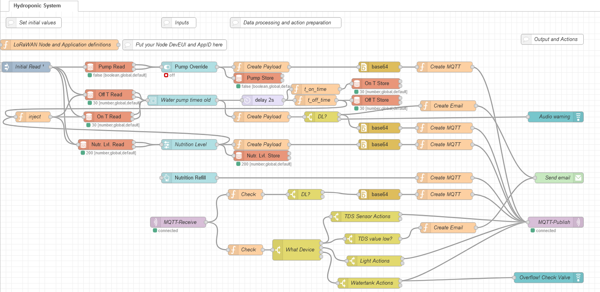

# Hydroponic-Control-System

This is a PoC for a hydroponic control system built with RAKwireless WisBlock modules.

The idea is to use the WisBlock system to measure

- nutrition level of the water with a TDS or EC sensor
- pH value of the water with a pH sensor (due to conflict between TDS and pH sensor not implemented)
- water level of the water tank (not implemented yet)

and to control

- water pump on and off times
- add nutrition if it is too low

As a backend control and visualization Grafana and NodeRED are used which are installed on a WisGate Connect RAK7391 together with a Chirpstack V4 LoRaWaN server and the gateway concentrator RAK2287 which connects the WisBlock Sensor and Control units with Chirpstack V4.

Some images of the PoC setup:
| Hydroponic System | WisBlock Sensor | Sensor | WisBlock Control |
| :---------------: | :-------------: | :--------------: | :-------------: |
|  |  |  |  |
| WisGate Connect | Chirpstack V4 | Grafana | NodeRED control |
|  |  |  |  |

## Data Flow

  

